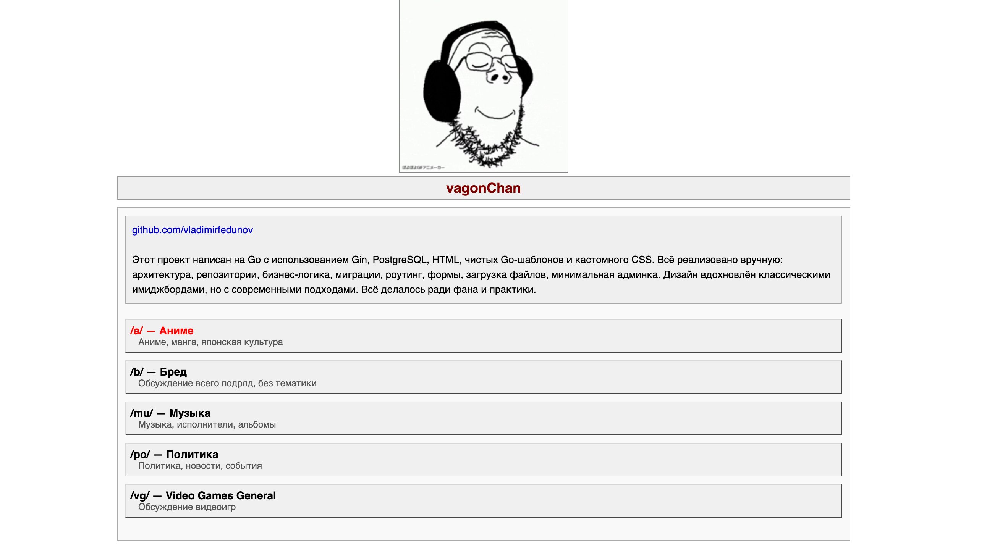
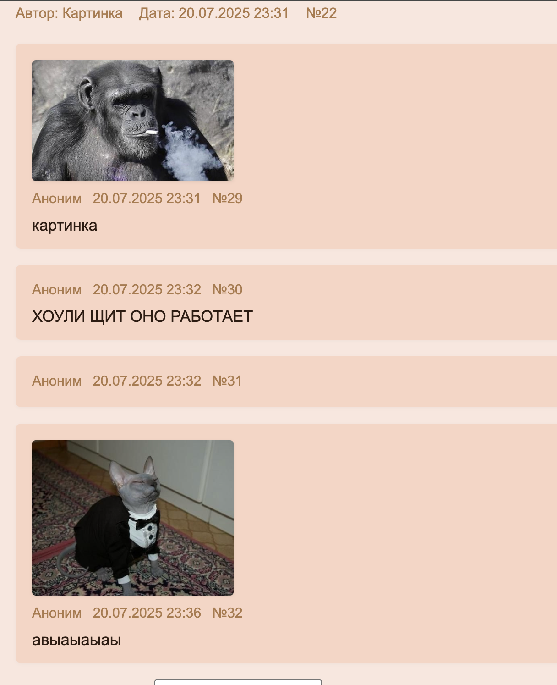

# 2ch-clone (vagonach)

Сырой клон двача (2ch) на Go.

## Описание

Этот проект — минималистичный клон классического имиджборда двач.  
Всё очень просто: доски, треды, посты, картинки, даже
админ панель завез, даже работает.

## Стек

- Go (Golang)
- PostgreSQL
- HTML5 + Go templates
- CSS 
- JS (минимум, только для модального окна)

## Скриншоты

